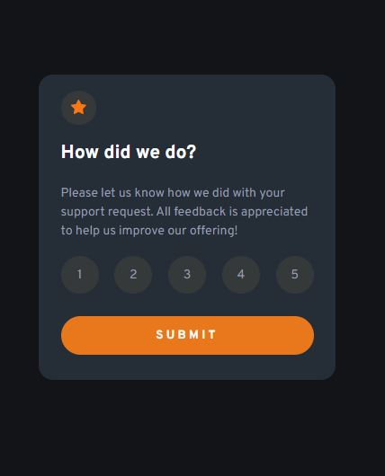

# Frontend Mentor - Interactive rating component solution

This is a solution to the [Interactive rating component challenge on Frontend Mentor](https://www.frontendmentor.io/challenges/interactive-rating-component-koxpeBUmI). Frontend Mentor challenges help you improve your coding skills by building realistic projects.

## Table of contents

- [Overview](#overview)
  - [The challenge](#the-challenge)
  - [Screenshot](#screenshot)
  - [Links](#links)
- [My process](#my-process)
  - [Built with](#built-with)
  - [What I learned](#what-i-learned)
- [Author](#author)
- [Acknowledgments](#acknowledgments)

## Overview

### The challenge

Users should be able to:

- See hover states for all interactive elements on the page
- Select and submit a number rating
- See the "Thank you" card state after submitting a rating

### Screenshot



### Links

- Solution URL: [https://github.com/Glorit74/interactive-rating-component-main](https://github.com/Glorit74/interactive-rating-component-main)
- Live Site URL: [https://glorit74.github.io/interactive-rating-component-main/](https://glorit74.github.io/interactive-rating-component-main/)

## My process

### Built with

- Semantic HTML5 markup
- CSS custom properties
- Javascript

### What I learned

```html
<button onclick="getVote()">Submit</button>
```

```js
let vote;

function getVote() {
  vote = document.querySelector('input[name="rate"]:checked').value;
  switchSection();
}

function switchSection() {
  let element = document.querySelector("main");
  element.remove();
  document.getElementById("root").insertAdjacentHTML("afterbegin", thankHTML);
  document.getElementById("myRate").innerHTML = vote;
}
```

## Author

- Frontend Mentor - [@Glorit74](https://www.frontendmentor.io/profile/Glorit74)

## Acknowledgments

Thanks to my school, Codecool!
